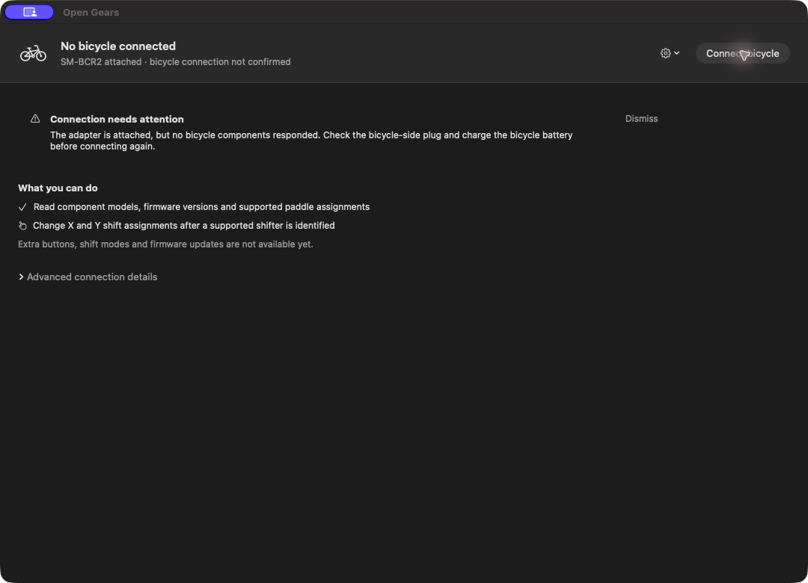
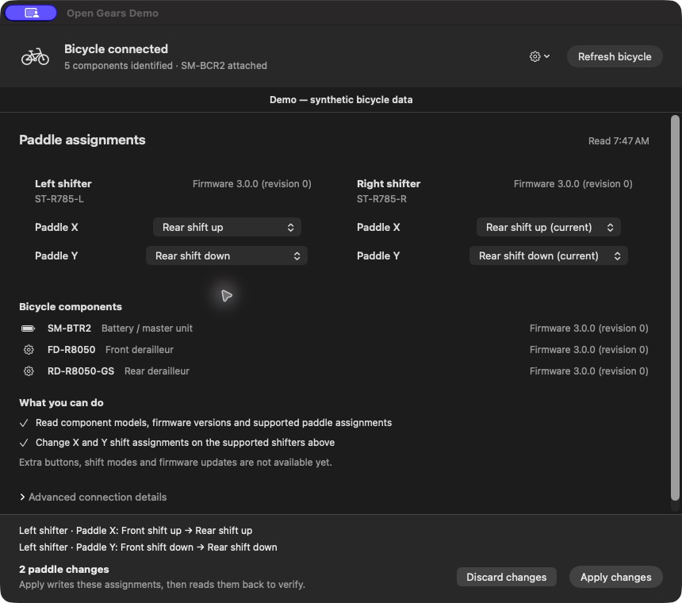

# Open Gears

Install on **macOS Tahoe 26 or later**:

```sh
curl -fsSL https://raw.githubusercontent.com/jgeurts/open-gears/v0.1.0-alpha.3/scripts/install.sh | sh
```

The installer chooses Apple silicon or Intel, verifies the release checksum, and installs **Open Gears.app** in `~/Applications`. It preserves an existing installation. Open the app from that folder; first-launch guidance is below.

A native Mac app and Go CLI for the Shimano SM-BCR2 USB charger/interface used by older Di2 bicycles. Connect the bicycle, see its identified shifters, and change their X/Y shift assignments with a before/after preview and readback verification.

Adapter access is verified on macOS. Component reads and paddle writes are experimental: the current hardware connection still reports **zero bicycle components**, so no actual shifter setting has been changed or verified yet.

This project is independent of Shimano and Specialized. The bicycle's model does not establish which Di2 components are installed.

## What works

| Capability | Status |
| --- | --- |
| Find SM-BCR2 and read USB descriptors | Verified on macOS with an actual `1e44:7220` adapter |
| Load the recognized OEM USB-controller image into volatile RAM | Verified on the same adapter; requires your local firmware file |
| Initialize, close, and reopen the controller's UART | Verified on macOS; drains bridge status notifications throughout the session |
| Read adapter link and application firmware version | Verified: **3.0.1, revision 0** on the test adapter |
| Prepare the adapter and read its component slot bitmap | Verified in adapter-master mode; the current connection reports zero bicycle components |
| Read bicycle component information and paddle assignments | Implemented, experimental; no actual component or paddle result has been verified |
| Analyze captures and decode serial frames offline | Implemented; parser and protocol tests use synthetic data |
| Change X/Y paddle assignments on identified conventional road/GRX shifters | Implemented with preview, fresh identity/settings checks, and readback; synthetic tests only |
| Change hood/sprinter buttons, shift modes, or other settings | Not implemented; existing extra-button assignments are preserved |
| Update adapter or bicycle flash firmware; run error checks | Not implemented |

The adapter's firmware version is not the bicycle components' firmware version. Loading the USB-controller RAM image is a separate operation from updating flash firmware.

Shimano lists SM-BCR2 compatibility with legacy E-Tube Project **3.4.5 and 4.0.4**, and excludes it from version 5 or later. Its desktop application is offered for Windows; it does not provide a native Mac USB client. [Shimano compatibility and system requirements](https://bike.shimano.com/en-NA/products/apps/e-tube-project-professional.html), [legacy V4 manual](https://bike.shimano.com/content/dam/one-website/common/products/apps/e-tube-project-professional/image/UM-7J4WA-002-ENG.pdf).

## Mac app

The Mac app and packaged CLI require **macOS Tahoe 26 or later**. Choose the Apple silicon (`arm64`) or Intel (`amd64`) package for your Mac from [Releases](https://github.com/jgeurts/open-gears/releases), extract it, and open **Open Gears.app**. Releases include their USB library; installing Homebrew or a separate USB driver is unnecessary.

The app has **no Developer ID signature or notarization**; local packaging uses an ad hoc signature. macOS may block the first launch. After checking the download's checksum and source, use the per-app **Open Anyway** option in System Settings → Privacy & Security. Do not disable Gatekeeper globally.

1. Plug SM-BCR2 into the bicycle's charging port and a USB data port on the Mac, then choose **Connect bicycle**.
2. If prompted, open the **Settings gear** and choose your local `umpf3410.i51` adapter support file. The selection is remembered; the controller image is loaded again when needed.
3. The app reads the bicycle and shows the current X/Y assignments on each identified shifter. It distinguishes **USB adapter attached** from **Bicycle connected**.
4. Choose a new function for X or Y. The original dropdown option is marked **(current)**. Review the visible current → requested changes, then choose **Apply changes**.
5. A verified result means the assignments were read back and matched. For an uncertain or partial result, refresh before trying another change; the app does not automatically repeat a write.

Supported initial targets are left/right ST-R785, ST-6870, ST-R8050, ST-R8070, ST-RX815, ST-R9150, and ST-R9170 with an identified SM-BTR2 or BT-DN110 controller. Adapter firmware must be 3.0.0 or later. New X/Y assignments are front-up, front-down, rear-up, or rear-down. Existing hood/sprinter/dummy channels and any untouched model-specific paddle function are preserved. Unsupported components show the reason editing is unavailable.

The **Settings gear** contains the adapter support-file controls. **Advanced connection details** contains adapter firmware and diagnostic exports. Firmware updates and other setting editors are not available.

Only one app or CLI command should own the adapter at a time. See the recovery steps below if a bicycle read or cleanup fails.

Mac app screenshots:





The editor screenshot uses synthetic components to demonstrate the workflow. It is not a result from the current bicycle connection.

## Obtain the controller image

The test adapter reports **3.0.1**, the newest SM-BCR2 version listed in [Shimano's firmware history](https://bike.shimano.com/en-NA/products/apps/firmware-update.html), released July 15, 2016. Bicycle components have separate firmware versions; an adapter version does not tell you whether the shifters or derailleurs are current. Open Gears reports versions but does not install firmware updates.

SM-BCR2 starts with a USB-to-serial controller that needs its OEM RAM image after being plugged in. The required file is **`umpf3410.i51` from the SM-BCR2 Windows 10 64-bit USB driver package**. It is raw binary code despite the `.i51` suffix.

Obtain the original driver archive from Shimano or a trusted copy. The [Shimano driver manual](https://si.shimano.com/en/pdfs/um/7J4WU/UM-7J4WU-002-ENG.pdf) identifies the supported adapter/driver. A historical copy is available in [BetterShifting's driver archive](https://assets.bettershifting.com/drivers/SM-BCR2_Win10-64.zip); that is a third-party mirror. Extract the ZIP locally; no Windows installation or execution is needed.

For the archive layout used during development:

```sh
unzip ~/Downloads/SM-BCR2_Win10-64.zip -d ~/Downloads/shimano-sm-bcr2
shasum -a 256 ~/Downloads/shimano-sm-bcr2/SM-BCR2_Win10-64/umpf3410.i51
```

The only accepted image is **14,336 bytes** with SHA-256:

```text
2a392186cf3d93b6a56514cdcd483a26097bf20b2bfc744bad7bb2fa1fd8bcd6
```

The app and CLI reject other images. The image is proprietary and is not included in this repository or release packages. Keep it locally; do not attach it to an issue or commit it.

## CLI

CLI release archives contain `open-gears` and its adjacent `lib` directory. Keep them together. macOS is the primary target; Linux CLI builds are secondary and have not been tested with the bicycle. Windows support is not implemented.

The installed Mac app also contains the CLI:

```sh
"$HOME/Applications/Open Gears.app/Contents/MacOS/open-gears" version
```

```sh
# Report the build version and commit.
./open-gears version

# Read descriptors without starting an adapter or bicycle session.
./open-gears devices

# Initialize the controller if needed, then read the adapter.
./open-gears adapter info --firmware /path/to/umpf3410.i51

# Attempt experimental bicycle discovery and paddle reads.
./open-gears bike inspect --firmware /path/to/umpf3410.i51

# Build a preview for an observed shifter slot. X=A, Y=B.
# Replace 2 with the slot returned by your bicycle read.
./open-gears bike paddles plan --slot 2 --a rear-down --b rear-up \
  --firmware /path/to/umpf3410.i51 > paddle-plan.json

# Inspect the preview, then apply exactly that plan.
cat paddle-plan.json
./open-gears bike paddles apply --plan paddle-plan.json \
  --firmware /path/to/umpf3410.i51

# Save an adapter trace in a new file.
./open-gears adapter info --firmware /path/to/umpf3410.i51 --trace adapter.jsonl

# Inspect that trace or decode a known adapter response offline.
./open-gears capture analyze adapter.jsonl
./open-gears protocol decode 'bb25300100aabb'
```

Live command results are JSON. Errors go to stderr with a nonzero exit status. `adapter initialize --firmware FILE` only loads controller RAM; `adapter info` handles initialization automatically when the adapter is in boot mode. Bicycle reads also reset and prepare the adapter, reconnecting and restoring its controller image if needed. If multiple adapters are connected, use `--bus N --address N` from `devices`. USB addresses can change after initialization.

A paddle plan pins the physical USB port, component identity, firmware, and current assignments. Apply checks every requested shifter again before the first write. A stale preview is rejected. Apply can return JSON describing verified, unchanged, partial, or unknown outcomes even with a nonzero exit status; retain that output. Multi-shifter changes are sequential, not atomic. After a partial or uncertain result, read the bicycle again before creating another preview. To restore old assignments, create a fresh inverse preview from the new read; never replay an old plan blindly.

`--trace` creates a new private JSONL file and refuses to overwrite an existing file. Controller firmware-upload payloads are excluded. If trace storage fails, USB communication and session cleanup continue, then the command reports the incomplete trace. Other trace contents can identify components, so review them before sharing. Imported external captures are not automatically stripped of firmware data.

For existing USBPcap/Wireshark captures, `capture fields` prints the matching `tshark` export command. Then:

```sh
./open-gears capture import capture.tsv --bus 1 --address 12 > capture.jsonl
./open-gears capture analyze capture.jsonl
./open-gears capture diff before.jsonl after.jsonl
```

Use the bus/address from your capture, not the example values. Offline commands do not access the adapter.

## Build from source

Install Go **1.24 or later**. Mac builds target **macOS Tahoe 26 or later**; Apple's Command Line Tools provide Swift, clang, and make. Linux needs a C compiler, make, curl, tar, and patch. The build fetches pinned dependencies over the network and builds its own libusb; pkg-config and a Homebrew libusb installation are unnecessary.

```sh
git clone https://github.com/jgeurts/open-gears.git
cd open-gears
git checkout v0.1.0-alpha.3
make build
./bin/open-gears devices

# macOS only
make app
open 'bin/Open Gears.app'
```

`make check` runs formatting checks, vet, Go race tests, native Mac helper tests, and isolated installer tests. `make package` creates distributable archives in `dist`. Build entry points use `scripts/build.sh`; compiled files and private dependencies stay outside version control.

Mac packages dynamically link libusb **1.0.30** with the upstream shutdown fix from [PR #1780](https://github.com/libusb/libusb/pull/1780), commit `94a5224`. The release includes the corresponding patched libusb source archive and license. See [CONTRIBUTING.md](CONTRIBUTING.md) for release checks.

## Troubleshooting

- **Adapter not found:** use a USB data cable, connect directly to the Mac where possible, and try another port. A charger connected without a data path cannot appear in `devices`.
- **No serial port:** expected on macOS. Open Gears uses native USB access to the TI bridge; a `/dev/cu.*` device is unnecessary.
- **Image rejected:** check the filename, size, and SHA-256 above. Bicycle firmware and other TI controller images are not interchangeable.
- **Adapter in boot mode after disconnect:** supply the local image again. Controller RAM is volatile.
- **Busy/access error:** close other USB clients. Linux may require a narrowly scoped udev permission rule or handling a kernel driver; broad permissions are unnecessary.
- **Intermittent close error with 0.1.0-alpha.1:** update to 0.1.0-alpha.2 or later. Earlier builds enabled bridge status notifications without reading them, which could make UART close fail and return the adapter to boot mode. USB and trace errors remain visible in current builds.
- **Adapter query works, but no bicycle units are found:** this is the current hardware result. Check the bike-side connection and bicycle battery; an empty bitmap alone does not establish a disconnected plug or any particular cause. Retain the result and sanitized trace for diagnosis.
- **Cleanup fails or shifting remains unavailable:** stop the app/CLI, disconnect SM-BCR2 from the bicycle and USB, then reconnect after the bicycle returns to normal. Do not ride with a service session still active. The client attempts cleanup, but USB loss can prevent confirmation.

See [protocol evidence](docs/protocol.md) for recovered commands, source hashes, and hardware findings. Report reproducible problems through [Issues](https://github.com/jgeurts/open-gears/issues); include OS, architecture, command, adapter version, and a sanitized trace. Tests do not substitute for hardware validation.

## License

Independent project code is [MIT licensed](LICENSE). Bundled libusb is LGPL-2.1-or-later, dynamically linked, with corresponding source distributed alongside releases. Google gousb is Apache-2.0 licensed. See [third-party notices](THIRD_PARTY_NOTICES.md). Shimano firmware, installers, and proprietary code are not redistributed or covered by this project's license.
